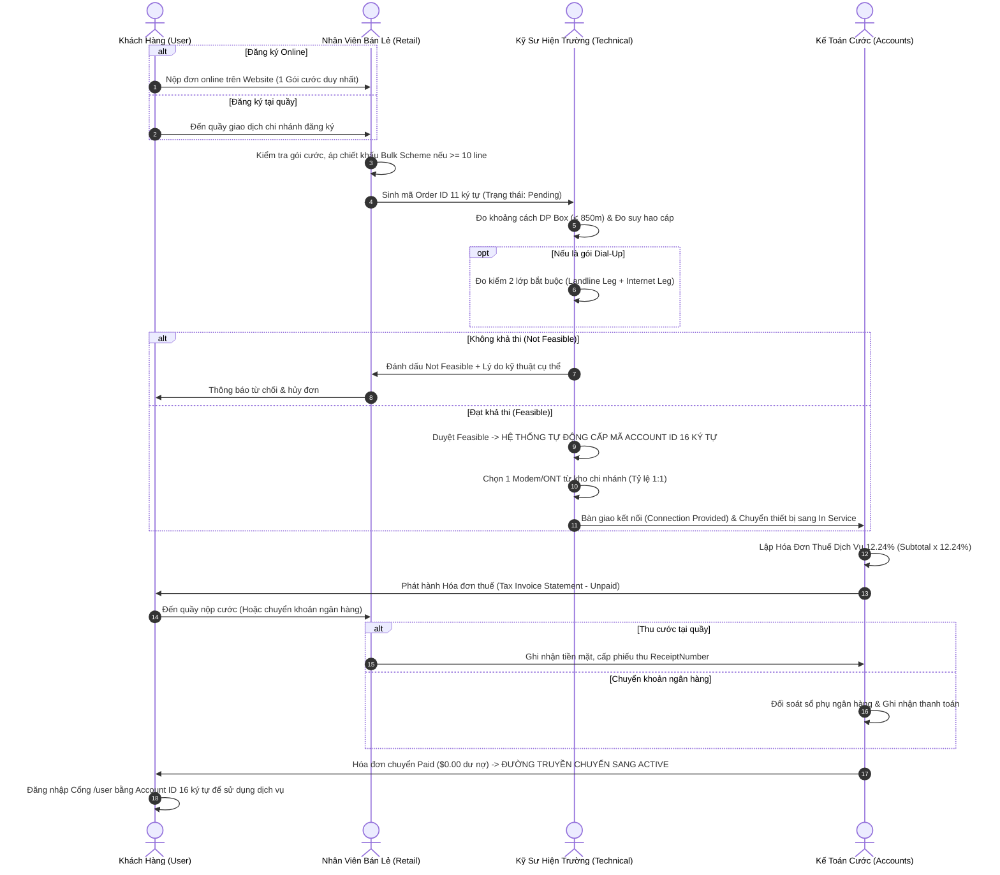
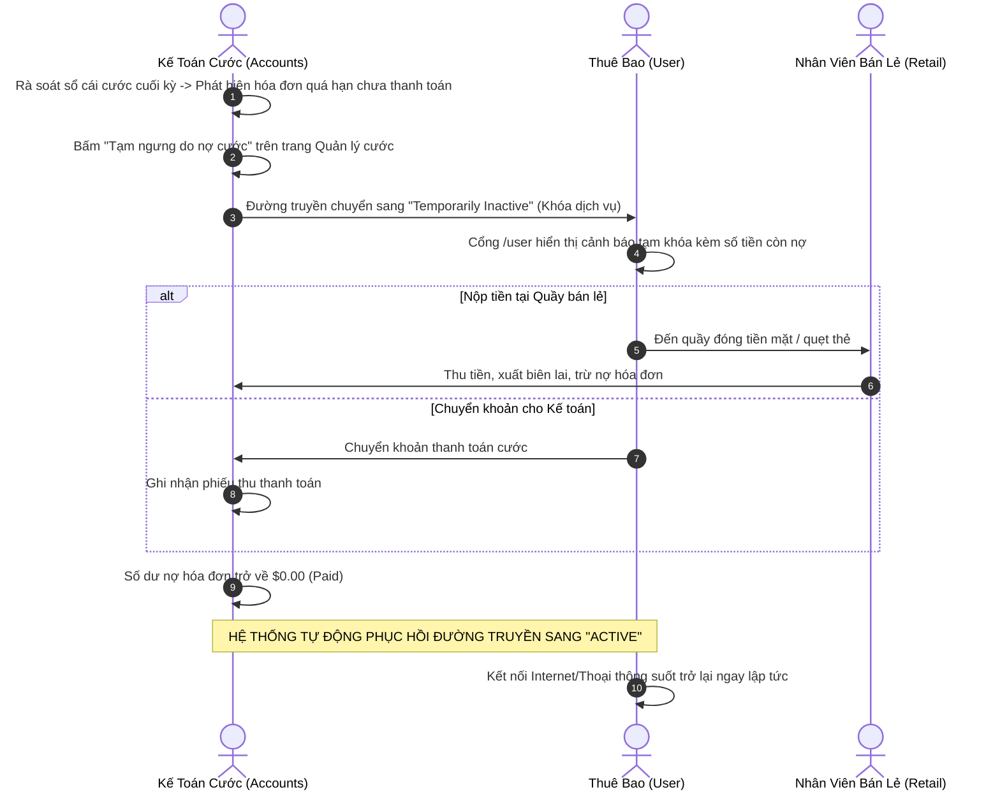
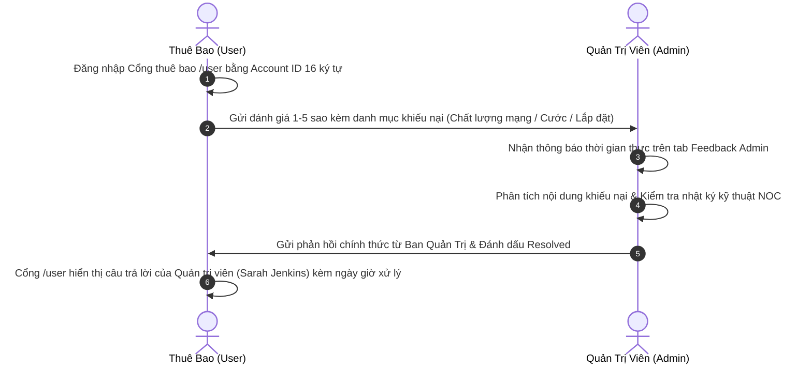
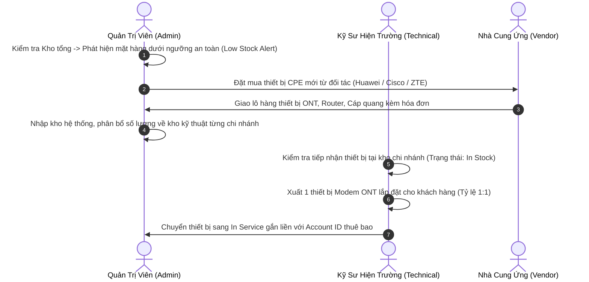

# BÁO CÁO CHI TIẾT HOẠT ĐỘNG VÀ QUY TRÌNH NGHIỆP VỤ TỪNG ROLE
## HỆ THỐNG MARKETING DỊCH VỤ & TÍNH CƯỚC VIỄN THÔNG (NEXUS SERVICE MARKETING SYSTEM)

> **Tài liệu tham chiếu chuẩn hóa:** Nghiệp vụ viễn thông toàn diện theo đặc tả kỹ thuật dự án (`SPEC-SUMMARY`), cơ sở dữ liệu Microsoft SQL Server (`NexusSystem`), Backend API .NET và Frontend ứng dụng Svelte 5.

---

## MỤC LỤC TỔNG QUAN

1. [Tổng Quan Kiến Trúc Phân Quyền & Hệ Sinh Thái Nexus](#1-tổng-quan-kiến-trúc-phân-quyền--hệ-sinh-thái-nexus)
2. [Bảng Tổng Hợp Danh Sách 5 Role Trong Hệ Thống](#2-bảng-tổng-hợp-danh-sách-5-role-trong-hệ-thống)
3. [Chi Tiết Hoạt Động Của Từng Role](#3-chi-tiết-hoạt-động-của-từng-role)
   - [3.1. Role: Khách Hàng / Thuê Bao (Customer / Subscriber - `user`)](#31-role-khách-hàng--thuê-bao-customer--subscriber---user)
   - [3.2. Role: Nhân Viên Bán Lẻ / Quầy Giao Dịch (Store Representative - `retail`)](#32-role-nhân-viên-bán-lẻ--quầy-giao-dịch-store-representative---retail)
   - [3.3. Role: Kỹ Sư Kỹ Thuật Hiện Trường & Vận Hành NOC (Field Operations Engineer - `technical`)](#33-role-kỹ-sư-kỹ-thuật-hiện-trường--vận-hành-noc-field-operations-engineer---technical)
   - [3.4. Role: Kế Toán Trưởng / Ban Tài Chính & Cước (Senior Accountant - `accounts`)](#34-role-kế-toán-trưởng--ban-tài-chính--cước-senior-accountant---accounts)
   - [3.5. Role: Giám Đốc Điều Hành / Quản Trị Viên Hệ Thống (General Manager / Admin - `admin`)](#35-role-giám-đốc-điều-hành--quản-trị-viên-hệ-thống-general-manager--admin---admin)
4. [Sơ Đồ Phối Hợp & Quy Trình Luân Chuyển Xuyên Suốt Giữa Các Role](#4-sơ-đồ-phối-hợp--quy-trình-luân-chuyển-xuyên-suốt-giữa-các-role)
   - [Quy trình 1: Vòng đời Đăng ký Mới -> Khảo sát -> Cấp kết nối -> Thu cước kích hoạt](#quy-trình-1-vòng-đời-đăng-ký-mới---khảo-sát---cấp-kết-nối---thu-cước-kích-hoạt)
   - [Quy trình 2: Xử lý Nợ cước -> Tạm ngưng dịch vụ -> Thanh toán -> Tự động kích hoạt lại](#quy-trình-2-xử-lý-nợ-cước---tạm-ngưng-dịch-vụ---thanh-toán---tự-động-kích-hoạt-lại)
   - [Quy trình 3: Tiếp nhận, Xử lý & Phản hồi Ý kiến Khiếu nại Khách hàng](#quy-trình-3-tiếp-nhận-xử-lý--phản-hồi-ý-kiến-khiếu-nại-khách-hàng)
   - [Quy trình 4: Chuỗi Cung ứng Thiết bị CPE & Vật tư Kỹ thuật Chi nhánh](#quy-trình-4-chuỗi-cung-ứng-thiết-bị-cpe--vật-tư-kỹ-thuật-chi-nhánh)
5. [Ma Trận Phân Quyền Truy Cập & Thao Tác Dữ Liệu (RBAC Matrix)](#5-ma-trận-phân-quyền-truy-cập--thao-tác-dữ-liệu-rbac-matrix)
6. [Bảng Quy Chuẩn Định Danh & Công Thức Cước Viễn Thông Bắt Buộc](#6-bảng-quy-chuẩn-định-danh--công-thức-cước-viễn-thông-bắt-buộc)

---

## 1. TỔNG QUAN KIẾN TRÚC PHÂN QUYỀN & HỆ SINH THÁI NEXUS

Hệ thống **Nexus Service Marketing System** là giải pháp phần mềm quản trị doanh nghiệp viễn thông khép kín, phụ trách toàn bộ vòng đời kinh doanh: Tiếp thị gói cước, Bán hàng tại quầy & Trực tuyến, Đo kiểm kỹ thuật hiện trường, Cấp phát thiết bị đầu cuối, Phát hành hóa đơn thuế dịch vụ và Thu hồi công nợ.

Hệ thống vận hành theo nguyên tắc **Phân quyền dựa trên vai trò (Role-Based Access Control - RBAC)** nghiêm ngặt, đảm bảo mỗi bộ phận chỉ truy cập đúng nghiệp vụ chức năng của mình nhưng dữ liệu luôn được đồng bộ thời gian thực qua cơ chế Store phản ứng nhanh.

```
                    ┌────────────────────────────────────────────────┐
                    │        KHÁCH HÀNG / THUÊ BAO (USER)            │
                    │  Đăng ký online, tra cứu đơn, xem cước, feedback│
                    └───────────────────────┬────────────────────────┘
                                            │ (1) Nộp đơn đặt hàng
                                            ▼
                    ┌────────────────────────────────────────────────┐
                    │      NHÂN VIÊN BÁN LẺ (RETAIL OUTLETS)         │
                    │  Tiếp nhận tại quầy, chiết khấu, thu tiền mặt  │
                    └───────────────────────┬────────────────────────┘
                                            │ (2) Chuyển hồ sơ khảo sát
                                            ▼
                    ┌────────────────────────────────────────────────┐
                    │     KỸ SƯ HIỆN TRƯỜNG / NOC (TECHNICAL)        │
                    │  Đo kiểm 2 lớp, cấp Account ID, gán modem/ONT  │
                    └───────────────────────┬────────────────────────┘
                                            │ (3) Bàn giao đường truyền
                                            ▼
                    ┌────────────────────────────────────────────────┐
                    │    KẾ TOÁN TRƯỞNG & CƯỚC (ACCOUNTS & BILLING)  │
                    │  Lập hóa đơn thuế 12.24%, đối soát, khóa/mở nợ │
                    └───────────────────────┬────────────────────────┘
                                            │ (4) Giám sát & báo cáo
                                            ▼
                    ┌────────────────────────────────────────────────┐
                    │     QUẢN TRỊ VIÊN CẤP CAO (GENERAL MANAGER)    │
                    │  Quản lý nhân sự, kho, gói cước, điểm bán, đối tác│
                    └────────────────────────────────────────────────┘
```

---

## 2. BẢNG TỔNG HỢP DANH SÁCH 5 ROLE TRONG HỆ THỐNG

| STT | Tên Vai Trò | Mã Role (`RoleType`) | Tuyến Đường (Route) | Nhân Sự Đại Diện Mẫu | Phòng Ban Trực Thuộc | Phạm Vi Trách Nhiệm Cốt Lõi |
| :---: | :--- | :---: | :---: | :--- | :--- | :--- |
| **1** | **Khách Hàng / Thuê Bao** | `user` | `/user` | *Thuê bao đăng nhập theo Account ID* | Khách hàng cá nhân & Doanh nghiệp | Xem thông số kết nối, thiết bị ONT bàn giao, tra cứu hóa đơn, gửi khiếu nại đánh giá sao. |
| **2** | **Nhân Viên Bán Lẻ** | `retail` | `/retail` | **David Chen** (`usr-retail-02`) | Quầy Bán Lẻ Chi Nhánh (SH-01 Flagship) | Tư vấn gói cước, lập đơn hàng mới tại quầy, tính chiết khấu đơn hàng lớn, thu cước trực tiếp. |
| **3** | **Kỹ Sư Hiện Trường** | `technical` | `/technical` | **Marcus Ramirez** (`usr-tech-03`) | Kỹ Thuật Hiện Trường & NOC | Khảo sát suy hao cáp, đo kiểm 2 lớp Dial-Up, sinh Account ID 16 ký tự, gán modem 1:1, điều khiển đường truyền. |
| **4** | **Kế Toán Cước** | `accounts` | `/accounts` | **Elena Rostova** (`usr-accounts-04`) | Phòng Kế Toán & Quản Lý Cước | Tính cước, phát hành hóa đơn thuế dịch vụ 12.24%, quản lý nợ cước, tạm khóa nợ và tự động mở lại khi trả đủ. |
| **5** | **Quản Trị Viên Hệ Thống**| `admin` | `/admin` | **Sarah Jenkins** (`usr-admin-01`) | Ban Giám Đốc (Executive Admin) | Quản trị toàn quyền nhân sự, kho vật tư, danh mục gói cước, mạng lưới chi nhánh, nhà cung ứng và giải quyết khiếu nại. |

---

## 3. CHI TIẾT HOẠT ĐỘNG CỦA TỪNG ROLE

---

### 3.1. Role: Khách Hàng / Thuê Bao (Customer / Subscriber - `user`)

#### A. Mục tiêu & Vị trí trong hệ thống:
Khách hàng là đối tượng thụ hưởng dịch vụ viễn thông của Nexus. Role `user` bao gồm 2 giai đoạn:
1. **Khách hàng tiềm năng (Chưa có kết nối):** Khám phá gói cước, đăng ký dịch vụ trực tuyến hoặc theo dõi tiến độ thi công qua Mã đơn hàng (Order ID 11 ký tự).
2. **Thuê bao chính thức (Đã có kết nối):** Sở hữu Mã tài khoản duy nhất (Account ID 16 ký tự), được cấp quyền truy cập Cổng thông tin thuê bao (`/user`).

#### B. Các trang màn hình & Chức năng phụ trách:

1. **Trang Giới Thiệu & Danh Mục Gói Cước ([IndexPage.svelte](file:///c:/Users/Admin/Documents/M%C3%A1y%20t%C3%ADnh/đồ%20án%20kì%203/moinhat/doanki3fe/src/pages/IndexPage.svelte)):**
   - Xem băng chuyền trượt ngang 16 gói cước thuộc 3 phân hệ dịch vụ:
     - **Broadband (Cáp quang băng rộng):** Tốc độ cao từ 64 Kbps đến 100 Mbps, cọc $500.
     - **Landline (Điện thoại cố định):** Gói cước thoại gia đình & doanh nghiệp, cọc $250.
     - **Dial-Up (Quay số qua mạng điện thoại):** Gói cước theo giờ tiết kiệm, cọc $325.
   - Sử dụng thanh cuộn ngang tùy biến và các nút điều hướng tròn để duyệt gói cước mà không che khuất thông tin.
   - Tìm kiếm điểm giao dịch chi nhánh Nexus gần nhất trên bản đồ mạng lưới.

2. **Trang Đăng Ký Dịch Vụ ([RegisterPage.svelte](file:///c:/Users/Admin/Documents/M%C3%A1y%20t%C3%ADnh/đồ%20án%20kì%203/moinhat/doanki3fe/src/pages/RegisterPage.svelte)):**
   - Điền thông tin cá nhân: Họ tên, Số điện thoại, Email, Địa chỉ lắp đặt chi tiết.
   - Chọn loại kết nối và gói cước mong muốn (Tuân thủ nghiêm ngặt nguyên tắc **1 Đơn hàng = Đúng 1 loại kết nối**).
   - Chọn số lượng đường truyền (Áp dụng chính sách chiết khấu đơn hàng lớn tự động nếu $\ge 10$ kết nối).
   - Đăng ký thành công nhận ngay **Mã đơn hàng 11 ký tự** (Ví dụ: `B0000000008` cho Broadband, `D0000000001` cho Dial-Up, `T0000000003` cho Landline).

3. **Cổng Tra Cứu Tiến Độ Đơn Hàng ([LoginPage.svelte](file:///c:/Users/Admin/Documents/M%C3%A1y%20t%C3%ADnh/đồ%20án%20kì%203/moinhat/doanki3fe/src/pages/LoginPage.svelte)):**
   - Nhập Order ID 11 ký tự để tra cứu tiến độ xử lý đơn thời gian thực:
     - `Pending`: Chờ kỹ thuật viên phân công khảo sát hiện trường.
     - `Feasible`: Đã khảo sát đạt tiêu chuẩn, hiển thị Account ID 16 ký tự vừa cấp.
     - `Not Feasible`: Thông báo không khả thi kèm lý do kỹ thuật.
     - `Connection Provided`: Đã bàn giao modem và cấp kết nối thành công.

4. **Cổng Thông Tin Thuê Bao Chính Thức ([UserDashboard.svelte](file:///c:/Users/Admin/Documents/M%C3%A1y%20t%C3%ADnh/đồ%20án%20kì%203/moinhat/doanki3fe/src/pages/UserDashboard.svelte)):**
   - Đăng nhập bảo mật trực tiếp bằng **Account ID 16 ký tự** (Ví dụ: `B064-000000000007`).
   - **Tab Tổng quan (Overview):**
     - Hiển thị tình trạng kết nối: `● Đang hoạt động` (Active), `● Tạm ngưng` (Temporarily Inactive), hoặc `● Chấm dứt` (Permanently Inactive).
     - Chi tiết gói cước đang sử dụng, tốc độ cam kết, địa chỉ lắp đặt, ngày kích hoạt.
     - Thông tin chi nhánh bán lẻ phụ trách hỗ trợ trực tiếp.
     - Thông số thiết bị CPE đã bàn giao: Tên thiết bị (Modem ONT/Router Wi-Fi), Số Serial, Địa chỉ MAC, Địa chỉ IP tĩnh/động.
   - **Tab Hóa đơn cước (Bills & Payments):**
     - Theo dõi kỳ cước hàng tháng, tổng tiền cọc, cước thuê bao, cước phát sinh theo giờ, thuế dịch vụ 12.24%.
     - Xem trạng thái thanh toán (`Đã thanh toán` / `Chưa thanh toán` / `Thanh toán một phần`).
   - **Tab Phản hồi & Đánh giá chất lượng (Customer Feedback):**
     - Gửi đánh giá 1-5 sao về chất lượng dịch vụ.
     - Chọn danh mục khiếu nại/góp ý: `Service Quality` (Chất lượng mạng), `Installation` (Thi công lắp đặt), `Billing` (Cước phí), `Support` (Hỗ trợ kỹ thuật).
     - Nhập nội dung phản hồi chi tiết và theo dõi câu trả lời từ Quản trị viên Admin.
   - **Tab Cài đặt & Hồ sơ cá nhân (`SettingsView` & `ProfileView`):**
     - Chuyển đổi ngôn ngữ hiển thị (Select Options: 🇻🇳 Tiếng Việt / 🇬🇧 English) với hiệu ứng CSS animation mượt mà.
     - Đổi chế độ Sáng/Tối (Light/Dark Mode).
     - Cập nhật thông tin liên lạc cá nhân, số điện thoại, ảnh đại diện avatar.

#### C. Dữ liệu Đầu vào & Đầu ra:
- **Đầu vào:** Hồ sơ đăng ký, địa chỉ lắp đặt, phản hồi đánh giá dịch vụ.
- **Đầu ra:** Mã Order ID (11 ký tự), Đơn đặt hàng mới, Bản ghi Feedback gửi lên Admin.

---

### 3.2. Role: Nhân Viên Bán Lẻ / Quầy Giao Dịch (Store Representative - `retail`)

#### A. Mục tiêu & Vị trí trong hệ thống:
Nhân viên bán lẻ làm việc trực tiếp tại các Chi nhánh / Điểm giao dịch (Retail Shops / Outlets). Đây là điểm tiếp xúc trực tiếp đầu tiên với khách hàng đến giao dịch tại quầy, đảm nhận việc tư vấn gói cước, tiếp nhận hồ sơ, tính toán chiết khấu đơn hàng lớn và thu cước tiền mặt/thẻ.

#### B. Các trang màn hình & Chức năng phụ trách ([RetailDashboard.svelte](file:///c:/Users/Admin/Documents/M%C3%A1y%20t%C3%ADnh/đồ%20án%20kì%203/moinhat/doanki3fe/src/pages/RetailDashboard.svelte)):

1. **Tab Tiếp Nhận Đơn Hàng Mới Tại Quầy (`new-order`):**
   - Nhập thông tin khách hàng tại quầy: Tên khách hàng, Số điện thoại, Email, Địa chỉ lắp đặt, Loại khách hàng (`Cá nhân` / `Doanh nghiệp`).
   - Chọn loại kết nối (`Broadband`, `Dial-Up`, `Landline`) và gói cước tương ứng.
   - **Cơ chế tính toán tiền đặt cọc (Security Deposit) tự động theo đặc tả:**
     - Broadband: **$500.00**
     - Dial-Up: **$325.00**
     - Landline: **$250.00**
   - **Áp dụng chính sách chiết khấu đơn hàng lớn (Bulk Scheme Discount):**
     - Khách hàng đăng ký nhiều đường truyền:
       - $10 - 14$ đường truyền: Giảm **25%**
       - $15 - 24$ đường truyền: Giảm **50%**
       - $25 - 50$ đường truyền: Giảm **75%**
       - $> 50$ đường truyền: Giảm **100%** (Miễn phí hoàn toàn cọc và cước ứng trước)
     - Giảm trừ trực tiếp trên: `Tiền đặt cọc + Cước thuê tháng đầu`.
   - Sinh mã đơn hàng chuẩn 11 ký tự và in biên nhận nộp đơn cho khách hàng.

2. **Tab Tra Cứu & Theo Dõi Tiến Độ Đơn Hàng Nâng Cao (`order-tracking`):**
   - Cung cấp **5 tiêu chí tìm kiếm đa chiều**:
     1. Mã đơn hàng duy nhất (11 ký tự)
     2. Họ tên khách hàng
     3. Loại kết nối (`Broadband`, `Dial-Up`, `Landline`, `Tất cả`)
     4. Số điện thoại liên lạc
     5. Khoảng thời gian nộp đơn (`Từ ngày` đến `Đến ngày`)
   - Bảng kết quả hiển thị tình trạng đơn hàng thời gian thực.
   - Bấm chọn đơn hàng xem **Sơ đồ tiến trình xử lý 4 giai đoạn (Lifecycle Stepper):**
     - Giai đoạn 1: `Order Logged` (Đã tiếp nhận hồ sơ)
     - Giai đoạn 2: `Feasibility Checked` (Đã khảo sát hiện trường - Đạt/Không đạt)
     - Giai đoạn 3: `Tech Dispatch` (Phân công kỹ thuật viên thi công)
     - Giai đoạn 4: `Connection Live` (Đã nghiệm thu, cấp Account ID và đường truyền online)

3. **Tab Tra Cứu Chi Tiết Đường Truyền & Nợ Cước (`connection-details`):**
   - Tra cứu hồ sơ thuê bao theo Account ID 16 ký tự hoặc số điện thoại.
   - Xem thông tin chi tiết: Tên thuê bao, Gói cước, Ngày lắp đặt, Địa chỉ thực tế, Hộp DP box kết nối, Chi nhánh phụ trách.
   - **Theo dõi chỉ số nợ cước (Outstanding Due Amount):** Hiển thị số tiền còn nợ từ sổ cái hóa đơn; tô đỏ cảnh báo nếu đang có nợ cước.
   - Hiển thị tình trạng đường truyền: `Active`, `Temporarily Inactive`, `Permanently Inactive`.

4. **Tab Thu Cước Trực Tiếp Tại Quầy Bán Lẻ (`payment-records`):**
   - Giải quyết tình huống khách hàng đến nộp tiền mặt hoặc quẹt thẻ POS tại quầy giao dịch chi nhánh.
   - Tìm kiếm hóa đơn theo Account ID 16 ký tự hoặc Mã hóa đơn.
   - Nhập số tiền thu, chọn phương thức (`Cash`, `Card / POS`, `Bank Transfer`).
   - Xuất mã phiếu thu duy nhất (`ReceiptNumber`) kèm thời điểm thanh toán.
   - **Kích hoạt tự động:** Nếu đường truyền đang bị tạm khóa do nợ cước, ngay khi thu đủ số tiền nợ về `$0.00`, hệ thống tự động phục hồi đường truyền sang `Active`.

5. **Tab Cài Đặt Chi Nhánh & Hồ Sơ Cá Nhân (`settings` & `profile`):**
   - Đổi chi nhánh làm việc tích cực (`selectedBranchCode`) để lọc đơn hàng và danh sách thiết bị theo từng chi nhánh cụ thể (Ví dụ: `SH-01` Downtown Flagship, `SH-02` Metro Uptown, `SH-03` Queens Center, `SH-04` Brooklyn Depot).
   - Tùy chỉnh ngôn ngữ hiển thị (Select Options: Tiếng Việt / English) và Dark/Light mode.

#### C. Dữ liệu Đầu vào & Đầu ra:
- **Đầu vào:** Thông tin khách hàng nộp đơn tại quầy, tiền mặt/chứng từ thanh toán cước.
- **Đầu ra:** Mã Order ID 11 ký tự, Đơn hàng mới trạng thái `Pending`, Phiếu thu cước thanh toán `ReceiptNumber`.

---

### 3.3. Role: Kỹ Sư Kỹ Thuật Hiện Trường & Vận Hành NOC (Field Operations Engineer - `technical`)

#### A. Mục tiêu & Vị trí trong hệ thống:
Kỹ sư kỹ thuật là người trực tiếp chịu trách nhiệm về chất lượng vật lý của đường truyền, kiểm tra tính khả thi hạ tầng trước khi ký hợp đồng, cấp phát Account ID, bàn giao thiết bị CPE từ kho chi nhánh và giám sát trạng thái kết nối trên mạng lưới.

#### B. Các trang màn hình & Chức năng phụ trách ([TechnicalDashboard.svelte](file:///c:/Users/Admin/Documents/M%C3%A1y%20t%C3%ADnh/đồ%20án%20kì%203/moinhat/doanki3fe/src/pages/TechnicalDashboard.svelte)):

1. **Tab Hàng Đợi Khảo Sát Hiện Trường (`feasibility-queue`):**
   - Tiếp nhận danh sách các đơn hàng mới ở trạng thái `Pending` từ Khách hàng Online hoặc Quầy bán lẻ.
   - Thực hiện kiểm tra đo đạc hạ tầng:
     - Đo khoảng cách cáp từ nhà khách hàng đến hộp chia cáp (DP Box). Tiêu chuẩn: Khoảng cách $\le 850\text{m}$. Nếu $> 850\text{m}$, suy hao vượt ngưỡng cho phép.
     - Đo dung lượng còn lại của cổng Splitter / Hộp DP.
   - **Quy tắc đo kiểm 2 lớp bắt buộc cho kết nối Quay số (Dual-Leg Feasibility for Dial-Up):**
     - Đơn Dial-Up bắt buộc phải đạt cả 2 nhánh:
       1. `LL Leg (Landline Leg):` Nhánh đường dây thoại vật lý.
       2. `NET Leg (Internet Leg):` Nhánh cổng mạng chuyển mạch DSLAM/PSTN.
     - *Ngoại lệ hợp lệ:* Nếu khách hàng đã sở hữu line thoại cố định của Nexus (`existingLandlineAccountId`), hệ thống tự động miễn nhánh `LL Leg`.
     - *Ràng buộc bảo vệ:* Nếu kỹ thuật viên bấm "Khả thi" khi chưa hoàn thành cả 2 nhánh, hệ thống lập tức cảnh báo chặn lại.
   - **Xử lý Đạt Khảo Sát Khả Thi (`Feasible`):**
     - Bấm duyệt "Khả thi" (`Mark Feasible`).
     - Hệ thống **TỰ ĐỘNG SINH MÃ TÀI KHOẢN ACCOUNT ID 16 KÝ TỰ CHÍNH THỨC** theo cú pháp chuẩn: `<Ký tự loại D/B/T> + <3 số CityCode> + <12 số serial kết nối>` (Ví dụ: `B064-000000000007`).
     - Đơn hàng chuyển sang trạng thái `Feasible`.
   - **Xử lý Không Khả Thi (`Not Feasible`):**
     - Bấm từ chối kỹ thuật, mở Modal nhập lý do từ chối cụ thể (Ví dụ: *"Distance to DP box exceeds standard copper/fiber specifications (> 850m). Excessive attenuation"*).
     - Đơn hàng chuyển sang trạng thái `Not Feasible`, thông báo tự động trả về khách hàng và nhân viên bán lẻ.
   - **Nghiệm Thu & Cấp Kết Nối Hoàn Tất (`Connection Provided`):**
     - Sau khi kéo cáp và lắp đặt hoàn tất, kỹ sư bấm "Cấp kết nối" (`Provide Connection`).
     - Mở Modal chọn **duy nhất 1 thiết bị Modem/ONT từ kho chi nhánh (Tỷ lệ 1:1)**.
     - Nhập địa chỉ IP cấp phát, cổng đấu nối DP Box, ngày hoàn công.
     - Hệ thống đưa thiết bị CPE từ `In Stock` sang `In Service`, gắn chặt với Account ID của khách hàng và chuyển đơn hàng sang `Connection Provided`.

2. **Tab Quản Lý Trạng Thái Đường Truyền (`connection-manager`):**
   - Tra cứu tức thời theo Account ID 16 ký tự.
   - **Bộ điều khiển chuyển đổi 3 trạng thái đường truyền (3-Way Status Toggle):**
     1. `Active (Đang hoạt động):` Đường truyền mở thông mạng Internet/Thoại bình thường.
     2. `Temporarily Inactive (Tạm ngưng dịch vụ):` Tạm ngưng do yêu cầu khách hàng (đi công tác, nghỉ hè) hoặc nợ cước quá hạn. Cổng mạng bị khóa tạm thời.
     3. `Permanently Inactive (Ngắt kết nối vĩnh viễn):` Khách hàng chấm dứt hợp đồng; lệnh thu hồi thiết bị Modem/ONT về kho chi nhánh được kích hoạt.
   - Ghi nhận nhật ký kỹ thuật NOC (Lý do chuyển đổi trạng thái, người thực hiện, thời điểm).

3. **Tab Quản Lý Kho Thiết Bị Đầu Cuối CPE (`equipment-tracker`):**
   - Quản lý toàn bộ thiết bị CPE tại chi nhánh: GPON ONT (Huawei EchoLife), Router Wi-Fi 6 (Nexus Wi-Fi 6 Router), Modem VDSL2 (Cisco Business Gateway).
   - Theo dõi trạng thái từng thiết bị:
     - `In Service`: Đang gắn và hoạt động tại nhà khách hàng (hiển thị rõ Account ID liên kết).
     - `In Stock`: Thiết bị mới, sẵn sàng trong kho để kỹ thuật viên mang đi lắp đặt.
     - `Maintenance`: Thiết bị đang được phòng kỹ thuật bảo trì, cập nhật firmware.
     - `Faulty`: Thiết bị hỏng, chờ thanh lý hoặc bảo hành từ Nhà cung cấp.
   - Thêm mới thiết bị CPE vào kho chi nhánh (Nhập Số Serial, MAC Address, Model, Hãng sản xuất).

4. **Tab Cài Đặt & Hồ Sơ Cá Nhân (`settings` & `profile`):**
   - Lựa chọn ngôn ngữ hiển thị (Select Options: Tiếng Việt / English) và theme giao diện tối ưu làm việc ban đêm.

#### C. Dữ liệu Đầu vào & Đầu ra:
- **Đầu vào:** Đơn hàng `Pending` cần khảo sát, thông số đo suy hao, thiết bị CPE trong kho.
- **Đầu ra:** Kết quả khảo sát (`Feasible` / `Not Feasible`), **Mã Account ID 16 ký tự được cấp mới**, Kết nối được bàn giao (`Connection Provided`), Trạng thái đường truyền (`Active`/`Inactive`).

---

### 3.4. Role: Kế Toán Trưởng / Ban Tài Chính & Cước (Senior Accountant - `accounts`)

#### A. Mục tiêu & Vị trí trong hệ thống:
Kế toán cước quản trị dòng tiền, phát hành hóa đơn tài chính định kỳ, giám sát thuế dịch vụ viễn thông bắt buộc và quản lý việc tạm khóa / mở lại đường truyền theo trạng thái công nợ thực tế.

#### B. Các trang màn hình & Chức năng phụ trách ([AccountsDashboard.svelte](file:///c:/Users/Admin/Documents/M%C3%A1y%20t%C3%ADnh/đồ%20án%20kì%203/moinhat/doanki3fe/src/pages/AccountsDashboard.svelte)):

1. **Tab Lập & Phát Hành Hóa Đơn Thuế Dịch Vụ (`bill-generation`):**
   - Tra cứu thuê bao theo Account ID 16 ký tự để lập hóa đơn kỳ cước.
   - Hệ thống tự động nạp thông tin gói cước, tiền cọc, cước thuê bao tháng và tỷ lệ chiết khấu đơn hàng lớn từ đơn hàng gốc.
   - **Động cơ tính toán cước & thuế dịch vụ viễn thông 12.24%:**
     $$\text{Chiết khấu} = (\text{Tiền cọc} + \text{Cước thuê tháng}) \times \text{Tỷ lệ chiết khấu}$$
     $$\text{Tổng phụ (Subtotal)} = \text{Tiền cọc} + \text{Cước thuê tháng} + \text{Cước phát sinh theo giờ} - \text{Chiết khấu}$$
     $$\text{Thuế dịch vụ (Service Tax 12.24%)} = \text{Tổng phụ (Subtotal)} \times 12.24\%$$
     $$\text{Tổng tiền thực thanh toán} = \text{Tổng phụ (Subtotal)} + \text{Thuế dịch vụ}$$
   - **Xuất bản Hóa Đơn Thuế Dịch Vụ Chính Thức (Tax Invoice Statement Modal):**
     - Hiển thị đầy đủ: Mã hóa đơn (Invoice ID), Mã tài khoản (16 ký tự), Tên khách hàng, Địa chỉ, Kỳ tính cước, Bảng kê chi tiết từng khoản mục, Tỷ lệ chiết khấu, Tiền thuế 12.24% và Tổng thanh toán.
     - Hỗ trợ xem trước và in trực tiếp ra máy in hóa đơn (`window.print()`).
     - Lưu hóa đơn vào cơ sở dữ liệu ở trạng thái `Unpaid`.

2. **Tab Đối Soát Thanh Toán & Ràng Buộc Hóa Đơn - Đường Truyền (`payment-updates`):**
   - Tra cứu danh sách hóa đơn theo trạng thái: `Tất cả`, `Chưa thanh toán (Unpaid)`, `Thanh toán một phần (Partially Paid)`, `Đã thanh toán (Paid)`.
   - **Nghiệp vụ cốt lõi Postpaid Dependency (Trạng thái kết nối phụ thuộc vào Hóa đơn):**
     - Với hóa đơn chưa thanh toán quá hạn: Kế toán có nút hành động nhanh **"Tạm ngưng do nợ cước"**. Khi bấm, đường truyền của khách hàng lập tức chuyển sang `Temporarily Inactive` kèm thông báo: *"⚡ Tự động kích hoạt lại khi thu đủ cước"*.
     - Khi khách hàng nộp tiền (qua Chuyển khoản ngân hàng, Thẻ tín dụng, POS hoặc Tiền mặt):
       - Kế toán bấm **"Ghi nhận thanh toán" (`Record Payment`)**, nhập số tiền thu thực tế.
       - Hóa đơn cập nhật số dư nợ còn lại (`Outstanding Due Amount`).
       - Nếu số dư nợ trở về **`$0.00`** (Hóa đơn chuyển sang `Paid`), hệ thống **TỰ ĐỘNG KÍCH HOẠT LẠI ĐƯỜNG TRUYỀN SANG `Active` NGAY LẬP TỨC TRONG CÙNG MỘT THAO TÁC**. Ghi nhận nhật ký phục hồi dịch vụ tự động.

3. **Tab Cấu Hình Biểu Cước & Thuế Suất Toàn Cục (`charge-settings`):**
   - Cấu hình tập trung các thông số tài chính cho toàn bộ hệ thống:
     - Mức thuế dịch vụ viễn thông: **12.24%** (Bắt buộc theo đặc tả pháp lý).
     - Phí phạt thanh toán chậm: **5.0%** trên số tiền nợ.
     - Định mức tiền đặt cọc thiết bị mặc định: Broadband ($500), Dial-Up ($325), Landline ($250).

4. **Tab Cài Đặt & Hồ Sơ Cá Nhân (`settings` & `profile`):**
   - Cấu hình hiển thị song ngữ (Select Options: Tiếng Việt / English) và theme giao diện làm việc.

#### C. Dữ liệu Đầu vào & Đầu ra:
- **Đầu vào:** Mã Account ID 16 ký tự, số giờ sử dụng phát sinh, chứng từ thanh toán ngân hàng.
- **Đầu ra:** Hóa đơn thuế dịch vụ chính thức (Tax Invoice Statement), Phiếu ghi nhận thanh toán (`PaymentRecord`), Quyết định tạm khóa nợ cước hoặc phục hồi đường truyền tự động.

---

### 3.5. Role: Giám Đốc Điều Hành / Quản Trị Viên Hệ Thống (General Manager / Admin - `admin`)

#### A. Mục tiêu & Vị trí trong hệ thống:
Giám đốc điều hành / Quản trị viên cấp cao nắm toàn bộ quyền hạn cao nhất trong hệ thống. Phụ trách giám sát chỉ số kinh doanh toàn diện, thiết lập danh mục gói cước viễn thông, mở rộng mạng lưới chi nhánh bán lẻ, điều phối nhân sự, kiểm soát kho hàng và giải quyết các khiếu nại chất lượng dịch vụ của khách hàng.

#### B. Các trang màn hình & Chức năng phụ trách ([AdminDashboard.svelte](file:///c:/Users/Admin/Documents/M%C3%A1y%20t%C3%ADnh/đồ%20án%20kì%203/moinhat/doanki3fe/src/pages/AdminDashboard.svelte)):

1. **Tab Bảng Điều Khiển Tổng Quan Doanh Nghiệp (`overview`):**
   - Dashboard thời gian thực hiển thị các chỉ số đo lường hiệu quả cốt lõi (KPIs):
     - Tổng doanh thu cước lũy kế & Doanh thu theo từng chi nhánh.
     - Tổng số thuê bao đang hoạt động (`Active Connections`).
     - Số lượng đơn hàng mới đang chờ xử lý (`Pending Orders`).
     - Số lượng cảnh báo vật tư sắp hết trong kho (`Low Stock Alerts`).
     - Tỷ lệ hoàn thành khảo sát kỹ thuật thành công.

2. **Tab Quản Lý Nhân Sự Toàn Hệ Thống (`employees` - Độc quyền Admin):**
   - Theo dõi toàn bộ danh sách cán bộ công nhân viên trên toàn hệ thống.
   - Thêm mới nhân viên với đầy đủ thông tin: Mã nhân viên nội bộ (`EMP-xxxx`), Họ và tên, Email, Số điện thoại di động, Vai trò phân quyền (`General Manager`, `Store Representative`, `Field Operations Engineer`, `Senior Accountant`), Phòng ban công tác và Chi nhánh được phân công phụ trách.
   - Chỉnh sửa thông tin nhân sự và đình chỉ / kích hoạt trạng thái tài khoản nhân viên.

3. **Tab Quản Lý Kho Tổng & Vật Tư Kỹ Thuật (`stock`):**
   - Theo dõi tổng thể kho trang thiết bị mạng của doanh nghiệp.
   - Cảnh báo tự động các mặt hàng có số lượng tồn kho dưới ngưỡng an toàn (`Low Stock Alerts`).
   - Thống kê tổng giá trị tài sản thiết bị tồn kho.
   - Thêm mới, chỉnh sửa và xóa mặt hàng vật tư: Mã linh kiện, Danh mục (`Modem`, `Router`, `Fiber ONT`, `Splitter`, `Copper Cable`), Số lượng tồn, Định mức đặt lại tối thiểu, Đơn giá nhập và Nhà cung cấp phụ trách.

4. **Tab Quản Lý Đối Tác & Nhà Cung Ứng (`vendors`):**
   - Quản lý danh mục các tập đoàn sản xuất thiết bị viễn thông hợp tác với Nexus (Huawei, Cisco, ZTE, TP-Link, D-Link...).
   - Thêm mới đối tác: Mã nhà cung cấp (`VND-xxx`), Tên công ty, Mã số thuế, Người liên hệ đại diện, Số điện thoại, Email, Địa chỉ trụ sở và Danh mục thiết bị cung ứng chính.

5. **Tab Quản Lý Mạng Lưới Chi Nhánh Bán Lẻ (`shops`):**
   - Quản trị toàn bộ các Điểm bán lẻ / Showroom viễn thông của công ty:
     - `SH-01:` Downtown Nexus Flagship Store (Mã vùng CityCode: `064` - Manhattan, New York)
     - `SH-02:` Metro Uptown Tech Hub (Mã vùng CityCode: `064` - Upper West Side, New York)
     - `SH-03:` Queens Central Service Center (Mã vùng CityCode: `072` - Forest Hills, Queens)
     - `SH-04:` Brooklyn Nexus Connect Depot (Mã vùng CityCode: `081` - Boerum Hill, Brooklyn)
   - Thêm mới chi nhánh bán lẻ: Tên showroom, Mã chi nhánh, Mã thành phố 3 số (Dùng làm tiền tố sinh mã Account ID 16 ký tự), Địa chỉ chi nhánh, Điện thoại liên hệ, Giám đốc showroom phụ trách.

6. **Tab Quản Lý Danh Mục Gói Cước Viễn Thông (`plans`):**
   - Thiết kế và phát hành các gói cước tiếp thị ra thị trường:
     - Gói Cáp quang Broadband (Băng thông, cước thuê tháng, định mức cọc $500).
     - Gói Điện thoại cố định Landline (Định mức cọc $250, giá cước cuộc gọi nội hạt/liên tỉnh).
     - Gói Quay số Dial-Up (Định mức cọc $325, giá cước trọn gói hoặc tính theo giờ).
   - Thiết lập chu kỳ tính cước: `Gói theo giờ (Hourly Pack)`, `Hàng tháng (Monthly)`, `Hàng quý (Quarterly)`, `Nửa năm (Half-Yearly)`, `Hàng năm (Yearly)`.
   - Bật cờ nổi bật khuyến mãi (`IsPopular`) để ưu tiên hiển thị trên Landing Page trang chủ.

7. **Tab Xử Lý Phản Hồi & Đánh Giá Của Khách Hàng (`feedback`):**
   - Tiếp nhận toàn bộ đánh giá 1-5 sao và ý kiến khiếu nại của khách hàng từ Cổng thông tin thuê bao `/user`.
   - Xem chi tiết phản hồi: Tên khách hàng, Account ID, Đơn hàng liên kết, Thời gian gửi, Phân loại vấn đề.
   - **Gửi câu trả lời phản hồi chính thức từ Ban Quản Trị:** Nhập nội dung phản hồi và chuyển trạng thái khiếu nại sang `Resolved` (Đã xử lý). Câu trả lời lập tức hiển thị đồng bộ trên giao diện của khách hàng.

8. **Tab Cài Đặt Hệ Thống & Hồ Sơ Cá Nhân (`settings` & `profile`):**
   - Tùy chỉnh ngôn ngữ hiển thị (Select Options: Tiếng Việt / English) với CSS animation.
   - Tùy chỉnh chế độ hiển thị Sáng/Tối.
   - Kiểm tra phiên bản hệ thống (Nexus OS v2.4.1) và cập nhật các bản vá bảo mật toàn hệ thống.

#### C. Dữ liệu Đầu vào & Đầu ra:
- **Đầu vào:** Kế hoạch mở rộng chi nhánh, hợp đồng nhà cung ứng, hồ sơ nhân sự mới, danh mục gói cước tiếp thị, phản hồi khiếu nại của khách hàng.
- **Đầu ra:** Quyết định phê duyệt nhân sự, Mã chi nhánh mới, Gói cước mới phát hành ra thị trường, Câu trả lời giải quyết khiếu nại khách hàng.

---

## 4. SƠ ĐỒ PHỐI HỢP & QUY TRÌNH LUÂN CHUYỂN XUYÊN SUỐT GIỮA CÁC ROLE

### Quy trình 1: Vòng đời Đăng ký Mới -> Khảo sát -> Cấp kết nối -> Thu cước kích hoạt



---

### Quy trình 2: Xử lý Nợ cước -> Tạm ngưng dịch vụ -> Thanh toán -> Tự động kích hoạt lại



---

### Quy trình 3: Tiếp nhận, Xử lý & Phản hồi Ý kiến Khiếu nại Khách hàng



---

### Quy trình 4: Chuỗi Cung ứng Thiết bị CPE & Vật tư Kỹ thuật Chi nhánh



---

## 5. MA TRẬN PHÂN QUYỀN TRUY CẬP & THAO TÁC DỮ LIỆU (RBAC MATRIX)

> **Ký hiệu quyền hạn:**
> - `C (Create):` Thêm mới bản ghi.
> - `R (Read):` Xem và tra cứu dữ liệu.
> - `U (Update):` Cập nhật, chỉnh sửa thông tin.
> - `D (Delete):` Xóa bản ghi.
> - `- :` Không có quyền truy cập.

| Thực Thể Dữ Liệu (Data Entity) | Khách Hàng (`user`) | Nhân Viên Bán Lẻ (`retail`) | Kỹ Sư Hiện Trường (`technical`) | Kế Toán Cước (`accounts`) | Quản Trị Viên (`admin`) |
| :--- | :---: | :---: | :---: | :---: | :---: |
| **Đơn hàng mới (Orders)** | C, R *(của mình)* | C, R, U *(tại quầy)* | R, U *(khảo sát)* | R *(đối soát)* | C, R, U, D |
| **Đường truyền (Connections)**| R *(của mình)* | R *(tra cứu nợ)* | R, U *(bàn giao/khóa)* | R, U *(khóa/mở nợ)* | C, R, U, D |
| **Thiết bị đầu cuối CPE** | R *(được gắn)* | R *(xem model)* | C, R, U *(kho chi nhánh)*| R *(tài sản)* | C, R, U, D *(kho tổng)* |
| **Kho vật tư & Linh kiện** | - | - | R *(vật tư cáp)* | R *(định giá kho)* | C, R, U, D |
| **Hóa đơn cước (Bills)** | R *(của mình)* | R *(tra cứu thu tiền)*| - | C, R, U *(lập hóa đơn)*| C, R, U, D |
| **Bản ghi thanh toán (Payments)**| R *(của mình)*| C, R *(thu tại quầy)* | - | C, R, U *(đối soát)* | C, R, U, D |
| **Phản hồi khiếu nại (Feedback)**| C, R *(của mình)* | - | - | - | R, U *(trả lời)* |
| **Gói cước dịch vụ (Plans)** | R *(xem biểu giá)* | R *(bán gói)* | R *(thông số mạng)* | R *(tính cước)* | C, R, U, D |
| **Chi nhánh bán lẻ (Retail Shops)**| R *(xem địa chỉ)* | R, U *(đổi chi nhánh)*| R *(chi nhánh kho)* | R *(đối soát)* | C, R, U, D |
| **Nhà cung ứng (Vendors)** | - | - | - | - | C, R, U, D |
| **Nhân viên nội bộ (Employees)**| - | - | - | - | C, R, U, D *(Độc quyền)*|
| **Cấu hình biểu cước & thuế**| - | - | - | R, U *(thuế 12.24%)* | C, R, U, D |

---

## 6. BẢNG QUY CHUẨN ĐỊNH DANH & CÔNG THỨC CƯỚC VIỄN THÔNG BẮT BUỘC

### 6.1. Quy chuẩn Cấu trúc Mã Đơn Hàng 11 Ký Tự (Order ID Scheme)
- **Cấu trúc:** `[Tiền tố loại kết nối] + [10 chữ số serial tăng dần toàn hệ thống]`
  - `B`: Gói cáp quang băng rộng (Broadband) — Ví dụ: `B0000000008`
  - `D`: Gói quay số Internet (Dial-Up) — Ví dụ: `D0000000001`
  - `T`: Gói thoại cố định (Telephone / Landline) — Ví dụ: `T0000000003`
- **Thời điểm cấp:** Ngay khi khách hàng bấm nộp đơn đăng ký (Online hoặc tại quầy bán lẻ).
- **Mục đích:** Theo dõi tiến độ thi công trước khi có mã tài khoản chính thức.

### 6.2. Quy chuẩn Cấu trúc Mã Tài Khoản 16 Ký Tự (Account ID Scheme)
- **Cấu trúc:** `[Tiền tố loại kết nối] + [Mã thành phố 3 số CityCode] + [12 chữ số serial kết nối]`
  - Định dạng hiển thị chuẩn: `[DBT][CityCode]-[12 số serial]` (Tổng cộng 16 ký tự thực thể: 1 chữ cái + 15 chữ số).
  - Ví dụ: `B064-000000000007` (Broadband tại New York City `064`, serial `7`).
- **Thời điểm cấp:** Ngay khi Kỹ sư vận hành hiện trường xác nhận đạt khảo sát kỹ thuật (`Feasible`).
- **Mục đích:** Khách hàng sử dụng làm tên đăng nhập duy nhất vào Cổng thông tin thuê bao `/user`.

### 6.3. Quy tắc cốt lõi: Một Đơn Hàng = Đúng Một Loại Kết Nối (One-Order-One-Connection)
- Mỗi đơn hàng đăng ký chỉ chọn duy nhất 1 gói cước thuộc 1 loại dịch vụ (`Broadband`, `Dial-Up`, hoặc `Landline`). Tuyệt đối không gộp nhiều loại dịch vụ vào cùng 1 Order ID để bảo toàn tính toàn vẹn của tiền tố mã định danh.

### 6.4. Bảng Định Mức Đặt Cọc Thiết Bị (Refundable Security Deposit)
- **Broadband (Cáp quang):** **$500.00**
- **Dial-Up (Quay số):** **$325.00**
- **Landline (Thoại cố định):** **$250.00**

### 6.5. Bảng Tỷ Lệ Chiết Khấu Đơn Hàng Lớn Cho Doanh Nghiệp (Bulk Scheme Discount)
- Áp dụng trên cơ sở: `Tiền cọc thiết bị + Cước thuê bao tháng đầu`.
  - $\ge 10$ đến $14$ đường truyền: Chiết khấu **25%**
  - $\ge 15$ đến $24$ đường truyền: Chiết khấu **50%**
  - $\ge 25$ đến $50$ đường truyền: Chiết khấu **75%**
  - $> 50$ đường truyền: Chiết khấu **100%** (Miễn phí 100% cọc và cước ứng trước).

### 6.6. Mức Thuế Dịch Vụ Viễn Thông Quy Định (Service Tax)
- Áp dụng mức thuế suất dịch vụ viễn thông chuẩn **12.24%** tính trên Tổng phụ (Subtotal) sau khi đã khấu trừ chiết khấu doanh nghiệp:
  $$\text{Tổng tiền hóa đơn} = \text{Tổng phụ (Subtotal)} \times (1 + 12.24\%)$$

---

*Tài liệu được biên soạn và chuẩn hóa phục vụ báo cáo đồ án kỳ 3, đối soát mã nguồn và kiểm thử toàn diện hệ thống viễn thông Nexus.*
